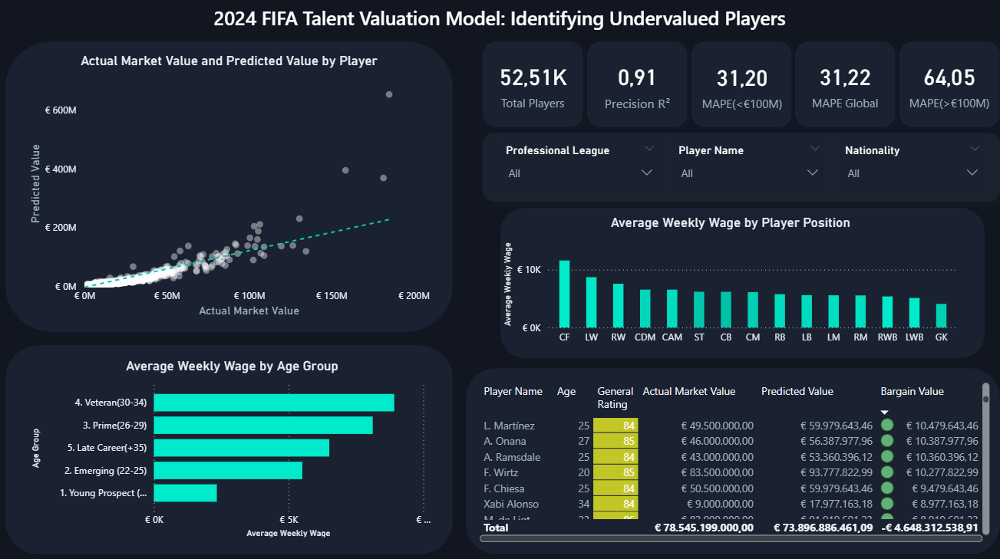

# FIFA Talent Valuation Model
### A log-linear regression approach to identifying undervalued football players

---

## Overview
Few industries move as much money with as little transparency as football's
transfer market. This project asks a simple question: **can observable player
data separate athletic value from market noise?**

Using the FIFA Male Players dataset (52,361 observations), a log-linear OLS
regression was built to estimate market value from three dimensions: athletic
quality, age trajectory, and market embeddedness (wage). The model achieves
R² = 0.91 and is designed to operate as a relative ranking tool — not a
precise price oracle — for identifying undervalued mid-tier talent.

---

## Business context
For clubs outside the financial elite, overpaying for the wrong player is not
just a sporting error — it is a financial one. This model provides a systematic
baseline to flag players whose asking price diverges meaningfully from their
modeled athletic value.

---

## Dataset
- **Source:** FIFA Male Players (Kaggle). Retrieved from https://www.kaggle.com/datasets/stefanoleone992/ea-sports-fc-24-complete-player-dataset/data
- **Raw observations:** ~53,000+
- **Final sample:** 52,361 (after IQR bilateral filtering + 3-sigma residual removal)
- **Target:** `value_eur` (market value in euros)

---

## Methodology

### Feature engineering
| Feature | Type | Rationale |
|---------|------|-----------|
| overall | Raw | Core athletic quality proxy |
| age_sq | Engineered | Captures non-linear value decay post-prime |
| wage_eur | Raw | Encodes institutional reputation and league context |

### Econometric decisions
- **Log transformation:** `log1p(value_eur)` applied — corrects severe right skew
- **Residual outlier removal:** 3-sigma rule removes 750 observations where
  structural model error exceeded 3 standard deviations (Q-Q tail anomalies)
- **Robust standard errors:** HC3 — justified by inherent heteroscedasticity
  in football transfer markets (Neymar-type outliers create non-constant variance)
- **No normality assumption needed:** Central Limit Theorem holds at n = 52,361

---

## Results

| Metric | Value |
|--------|-------|
| R² (full sample) | 0.915 |
| MAPE (test set) | 31.67% |
| MAPE (players under €100M) | ~31.20% |
| Mean absolute error | €377,484 |

All three predictors significant at the 5% level. Overall rating dominates.
Age² enters negative — value depreciates non-linearly after prime.
Wage adds predictive power beyond rating alone, likely capturing league
prestige and commercial profile.

---

## Diagnostic tests

| Test | Statistic | p-value | Conclusion |
|------|-----------|---------|------------|
| Breusch-Godfrey | 2.116 | 0.146 | No autocorrelation |
| Durbin-Watson | 2.013 | — | No serial correlation |
| Breusch-Pagan | — | 0.000 | Heteroscedasticity present → corrected via HC3 |
| VIF (all features) | < 10 | — | No multicollinearity |

---

## Limitations
- FIFA ratings are inherently subjective and scout-dependent
- Elite players (Mbappé, Haaland) are effectively untransferable —
  their commercial premium is structurally outside the model's scope
- Model is best interpreted as a **relative ranking tool**, not a valuation engine
- Three predictors by design — parsimony over complexity

---

## Dashboard

<i>Figure 1: This interactive dashboard visualizes our predictive model, instantly spotlighting 
undervaluation opportunities—like Martínez and Onana—by pitting real market prices against our data-driven estimations.
</i>

---

## Tech stack
- **Language:** Python 3
- **Libraries:** pandas · numpy · statsmodels · scikit-learn · scipy
- **Output:** CSV with predicted values + age segments, ready for Power BI

---

## Files
| File | Description |
|------|-------------|
| `Football.py` | Full pipeline: cleaning, modeling, diagnostics, export |
| `male_players_with_predictions_test.csv` | Output with predicted values |